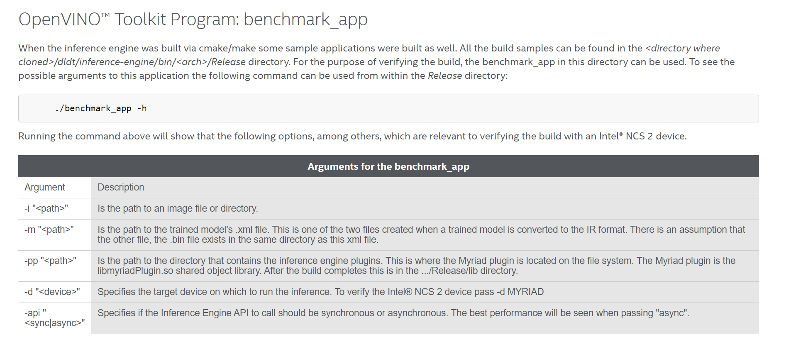

# Distiller
### Resnet20 baseline trained on cifar dataset
From the intel distiller repository root
`.../distiller $ time python3 examples/classifier_compression/compress_classifier.py --arch resnet20_cifar  data.cifar10 -p=50 --lr=0.3 --epochs=180 --compress=examples/ssl/resnet20_cifar_baseline_training.yaml -j=1 --deterministic --export-onnx`

# OpenVino
## Benchmark page:
[Link to some openvino benchmarking commands](https://software.intel.com/content/www/us/en/develop/articles/intel-neural-compute-stick-2-and-open-source-openvino-toolkit.html)

## Prepare model optimizer

[Link to openvino config scripts doc](https://docs.openvinotoolkit.org/latest/openvino_docs_MO_DG_prepare_model_Config_Model_Optimizer.html)

## import & convert ONNX

1. Activate OpenVino env
2. Run:
    `.../openvino $ python /opt/intel/openvino_2021/deployment_tools/model_optimizer/mo_onnx.py --input_model ../distiller/path_to.onnx `

## Run built in benchmark tool

1. Activate Benchmark env
2. Run:
    `.../openvino $ python inference-engine/tools/benchmark_tool/benchmark_app.py -m <Path-to-model (can be .onnx)> -i <Path to images> -d 'MYRIAD'`